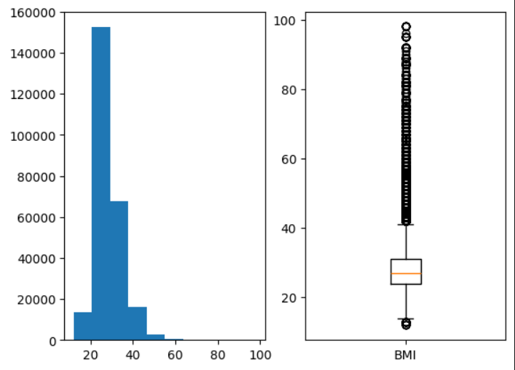
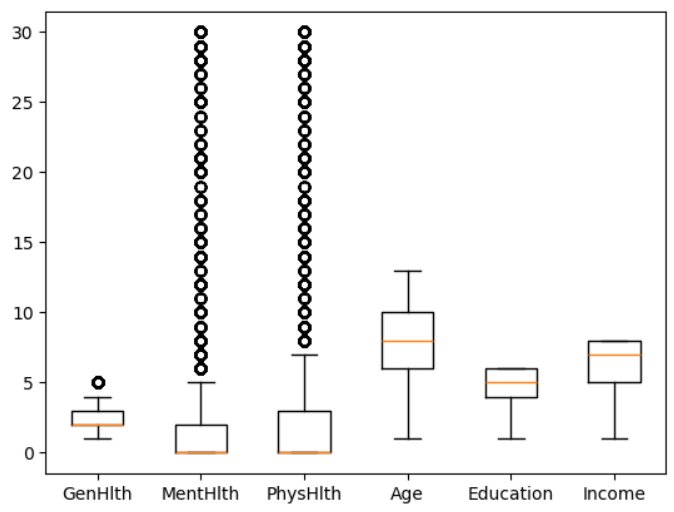
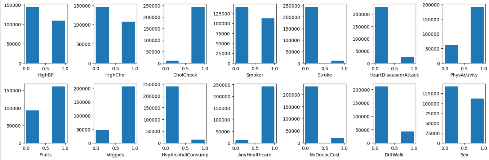

# :pill: Predicting diabetes

## :pushpin: Purpose of the work
In this work, I want to build a neural network that can best predict whether a person has diabetes or not.

## :bar_chart: EDA - Exploratory data analysis
| Name                   | Type    | Description                                                                                                           | Missing Values |
|------------------------|---------|-----------------------------------------------------------------------------------------------------------------------|----------------|
| ID                     | Integer | Patient ID                                                                                                            | No             |
| Diabetes_binary        | Binary  | 0 = no diabetes, 1 = prediabetes or diabetes                                                                          | No             |
| HighBP                 | Binary  | 0 = no high BP, 1 = high BP                                                                                           | No             |
| HighChol               | Binary  | 0 = no high cholesterol, 1 = high cholesterol                                                                         | No             |
| CholCheck              | Binary  | 0 = no cholesterol check in 5 years, 1 = yes cholesterol check in 5 years                                             | No             |
| BMI                    | Integer | Body Mass Index                                                                                                       | No             |
| Smoker                 | Binary  | Have you smoked at least 100 cigarettes in your entire life? (5 packs = 100 cigarettes) 0 = no, 1 = yes               | No             |
| Stroke                 | Binary  | (Ever told) you had a stroke. 0 = no, 1 = yes                                                                         | No             |
| HeartDiseaseorAttack   | Binary  | Coronary heart disease (CHD) or myocardial infarction (MI) 0 = no, 1 = yes                                            | No             |
| PhysActivity           | Binary  | Physical activity in past 30 days (not including job) 0 = no, 1 = yes                                                 | No             |
| Fruits                 | Binary  | Consume fruit 1 or more times per day 0 = no, 1 = yes                                                                 | No             |
| Veggies                | Binary  | Consume vegetables 1 or more times per day 0 = no, 1 = yes                                                            | No             |
| HvyAlcoholConsump      | Binary  | Heavy drinkers (Men > 14 drinks/week, Women > 7 drinks/week) 0 = no, 1 = yes                                          | No             |
| AnyHealthcare          | Binary  | Have any kind of health care coverage (insurance, HMO, etc.) 0 = no, 1 = yes                                          | No             |
| NoDocbcCost            | Binary  | Could not see a doctor due to cost in the past 12 months? 0 = no, 1 = yes                                             | No             |
| GenHlth                | Integer | General health rating (1 = excellent, 2 = very good, 3 = good, 4 = fair, 5 = poor)                                    | No             |
| MentHlth               | Integer | Days in past 30 when mental health was not good (1-30 days)                                                           | No             |
| PhysHlth               | Integer | Days in past 30 when physical health was not good (1-30 days)                                                         | No             |
| DiffWalk               | Binary  | Serious difficulty walking or climbing stairs? 0 = no, 1 = yes                                                        | No             |
| Sex                    | Binary  | 0 = female, 1 = male                                                                                                  | No             |
| Age                    | Integer | 13-level age category (1 = 18-24, 9 = 60-64, 13 = 80 or older)                                                        | No             |
| Education              | Integer | Education level (1 = No school, 2 = Elementary, 3 = Some HS, 4 = HS graduate, 5 = Some college, 6 = College graduate) | No             |
| Income                 | Integer | Income scale (1 = < $35,000, 8 = ≥ $75,000)                                                                           | No             |

Because there is many binary features I normalize the rest of the variables to have values between 0 and 1.

<p align="center">
    
    
    
</p>

After examining the boxplot, histograms and basic statistics, the following conclusions can be drawn about the dataset:
- most people rated their health as good or better
- at least half rated their mental and physical health as good every day in the past 30 days
- mean age is between 55 and 59, around 25% people is below 35 years old
- at least half the people attended college
- at least 25% of the people earn $75,000
- mean value of the BMI is euqal 28.38 and this is overveight,
- according to the standard definitions, a person is considered to have a normal weight if their BMI is below 24.9, and they are in the first quartile, which is defined as a BMI of 24. This indicates that slightly more than 25% of the population has a normal weight or is underweight.
- the boxplot shows that there is several people with BMI above 40 - this mean Obesity class III (the last group according BMI classification)
- there are more people with lower blood pressure and cholesterol levels,
- most people have had their cholesterol checked in the past five years,
- there are slightly more non-smokers,
- people who have had a stroke or heart attack are a small percentage of the group,
- almost 4 times as many people have done physical activity outside of work in the last 30 days and the number of people who eat at least one vegetable a day is also similar;
- it's interesting that more people eat vegetables every day than fruit.
- the vast majority do not drink alcohol often and have health insurance.
- a small percentage of people needed medical assistance but were unable to seek it due to the cost.
- most people had no problems climbing stairs or taking demanding walks.
- the data includes slightly more women than men.

> [!IMPORTANT]
> Most of the people in this group are not diabetic. This is important when we score the model because if the model will classify all people as healthy, it will still have good accuracy (in this case 86%). So, it's also important to look at precision and recall.

## :small_blue_diamond: Neural networks

Each network model was trained on different combinations of 3 parameters:
- batch size: 32, 64, 128, 256;
- learning rate: 0.1, 0.01, 0.001, 0.0001;
- activation function: Sigmoid, ReLU, Tanh, Softplus.

Other parameters have always been constant:
- number of epochs = 8
- loss function = Binary Cross Entropy
- optimization function = Adam()

### :small_blue_diamond: without hidden layers

```python
class NeuralNetwork1layer(nn.Module):
    def __init__(self):
        super().__init__()
        self.linear_relu_stack = nn.Sequential(
            nn.Linear(21, 1),
            nn.Sigmoid()
        )

    def forward(self, x):
        return self.linear_relu_stack(x)
```

| Learning Rate | Mean Accuracy | Standard Deviation Accuracy | Mean Precision | Standard Deviation Precision | Mean Recall | Standard Deviation Recall |
|--------------|--------------|----------------------------|---------------|-----------------------------|------------|--------------------------|
| 0.0001       | 83.29        | 0.56                       | 38.33         | 2.65                        | 32.86      | 3.42                     |
| 0.001       | 83.50        | 0.36                       | 40.87         | 0.39                        | 41.15      | 3.83                     |
| 0.01        | 84.68        | 0.67                       | 44.20         | 2.05                        | 35.73      | 6.14                     |
| 0.1         | 84.49        | 2.27                       | 46.81         | 9.46                        | 23.31      | 22.20                    |

| Batch Size | Mean Accuracy | Standard Deviation Accuracy | Mean Precision | Standard Deviation Precision | Mean Recall | Standard Deviation Recall |
|------------|--------------|----------------------------|---------------|-----------------------------|------------|--------------------------|
| 32         | 83.94        | 0.75                       | 41.28         | 1.62                        | 35.37      | 7.23                     |
| 64         | 83.55        | 1.80                       | 41.50         | 4.01                        | 38.72      | 11.18                    |
| 128        | 84.21        | 1.32                       | 45.45         | 9.42                        | 30.29      | 19.87                    |
| 256        | 84.27        | 1.43                       | 41.98         | 5.78                        | 28.67      | 11.09                    |

- for small values of learning rate and batch size scores are similar, because they have small standard deviation,
- precision and accurancy is better for bigger values of learning rate
- recall have the best scores for the middle values of lerning rate (0.001 and 0.01)
- similar accuracy is better for bigger batch size
- precision is similar, but for batch size euqal 128 is the best
- recall in the other hand is definitely more diverse and it is the best for the batch size euqal 64


### :small_blue_diamond: with 1 hidden layer

```python
class NeuralNetwork2layers(nn.Module):
    # dzięki parametrom można później ustalić ilość neuronów w warstwie oraz wybrać funkcję aktywacji
    def __init__(self, features=16, activation=nn.ReLU()):
        super().__init__()
        self.linear_relu_stack = nn.Sequential(
            nn.Linear(21, features),
            activation,
            nn.Linear(features, 1),
            nn.Sigmoid()
        )

    def forward(self, x):
        return self.linear_relu_stack(x)
```

| Learning Rate | Mean Accuracy | Standard Deviation Accuracy | Mean Precision | Standard Deviation Precision | Mean Recall | Standard Deviation Recall |
|--------------|--------------|----------------------------|---------------|-----------------------------|------------|--------------------------|
| 0.0001       | 83.62        | 0.54                       | 41.66         | 1.40                        | 43.59      | 3.86                     |
| 0.001       | 83.45        | 1.23                       | 42.32         | 2.13                        | 49.03      | 6.44                     |
| 0.01        | 84.18        | 1.51                       | 44.26         | 4.48                        | 41.22      | 10.62                    |
| 0.1         | 82.75        | 5.36                       | 12.89         | 17.36                        | 23.62      | 32.32                    |

| Activation Function | Mean Accuracy | Standard Deviation Accuracy | Mean Precision | Standard Deviation Precision | Mean Recall | Standard Deviation Recall |
|---------------------|--------------|----------------------------|---------------|-----------------------------|------------|--------------------------|
| ReLU               | 82.84        | 3.87                       | 36.04         | 14.98                        | 41.02      | 20.83                    |
| Sigmoid            | 83.23        | 3.59                       | 33.51         | 17.02                        | 40.00      | 21.86                    |
| Softplus           | 84.25        | 1.45                       | 38.19         | 15.33                        | 38.51      | 17.18                    |
| Tanh               | 83.67        | 1.67                       | 33.39         | 16.70                        | 37.92      | 19.68                    |

| Batch Size | Mean Accuracy | Standard Deviation Accuracy | Mean Precision | Standard Deviation Precision | Mean Recall | Standard Deviation Recall |
|------------|--------------|----------------------------|---------------|-----------------------------|------------|--------------------------|
| 32         | 84.46        | 1.55                       | 32.59         | 19.71                        | 32.48      | 21.42                    |
| 64         | 84.09        | 1.62                       | 34.43         | 17.23                        | 37.06      | 18.89                    |
| 128        | 82.00        | 4.75                       | 38.28         | 11.84                        | 47.06      | 19.29                    |
| 256        | 83.44        | 1.62                       | 35.82         | 14.19                        | 40.85      | 17.06                    |

- the best accuracy and precision are achieved with a learning rate of 0.01
- bigger difference is in the recall where the lowest score is euqal 23.62% (learning rate = 0.1) and the highest is 49.03% (learning rate = 0.001)
- when it comes to activation functions, Softplus performs best in terms of accuracy and precision, while Relu functions achieve the highest recall
- scores for batch size are similar in comparison to the rest parameters
- for batch size euqal 32 accuracy is the best, but precision and recall the worst
- for batch size euqal 128 precision and recall are the best, but accuracy the worst


### :small_blue_diamond: with 2 hidden layers

```python
class NeuralNetwork3layers(nn.Module):
    def __init__(self, features1=16, features2=16, activation=nn.ReLU()):
        super().__init__()
        self.linear_relu_stack = nn.Sequential(
            nn.Linear(21, features1),
            activation,
            nn.Linear(features1, features2),
            activation,
            nn.Linear(features2, 1),
            nn.Sigmoid()
        )

    def forward(self, x):
        return self.linear_relu_stack(x)
```

| Learning Rate | Mean Accuracy | Standard Deviation Accuracy | Mean Precision | Standard Deviation Precision | Mean Recall | Standard Deviation Recall |
|--------------|--------------|----------------------------|---------------|-----------------------------|------------|--------------------------|
| 0.0001       | 83.39        | 0.91                       | 41.70         | 1.85                        | 47.14      | 3.95                     |
| 0.001       | 83.64        | 0.88                       | 42.62         | 2.01                        | 48.24      | 5.21                     |
| 0.01        | 83.94        | 1.81                       | 39.66         | 11.47                        | 39.07      | 17.80                    |
| 0.1         | 84.48        | 3.60                       | 6.50          | 14.02                        | 12.38      | 26.78                    |

| Activation Function | Mean Accuracy | Standard Deviation Accuracy | Mean Precision | Standard Deviation Precision | Mean Recall | Standard Deviation Recall |
|---------------------|--------------|----------------------------|---------------|-----------------------------|------------|--------------------------|
| ReLU               | 83.11        | 2.72                       | 36.04         | 14.61                        | 42.38      | 19.03                    |
| Sigmoid            | 84.14        | 1.54                       | 31.64         | 18.96                        | 35.75      | 21.79                    |
| Softplus           | 84.32        | 2.07                       | 35.46         | 17.87                        | 36.20      | 19.83                    |
| Tanh               | 83.87        | 1.90                       | 27.34         | 19.15                        | 32.52      | 26.21                    |

| Batch Size | Mean Accuracy | Standard Deviation Accuracy | Mean Precision | Standard Deviation Precision | Mean Recall | Standard Deviation Recall |
|------------|--------------|----------------------------|---------------|-----------------------------|------------|--------------------------|
| 32         | 84.40        | 1.86                       | 29.63         | 20.89                        | 31.38      | 23.44                    |
| 64         | 84.53        | 1.25                       | 31.54         | 19.02                        | 31.68      | 22.44                    |
| 128        | 83.34        | 2.72                       | 33.39         | 16.85                        | 40.36      | 21.18                    |
| 256        | 83.17        | 2.14                       | 35.92         | 14.35                        | 43.43      | 18.71                    |

- when the learning rate is set to 0.1, the accuracy is the best, but the precision and recall are the worst (only 6.5% and 12.38%, respectively).
- the best value for learning rate is 0.001, because:
    - accuarcy is only slightly worst than the others, but it have the lowest standard deviation
    - recall and precision are the best
- in case of activation function I think ReLU and Softplus are better, because:
    - they have definitely beter precision and recall
    - slightly wors accuracy in comparison to the others activation function.
- for larger batch sizes, precision and recall are better; however, for accuracy, the opposite is true


### :small_blue_diamond: with 3 hidden layers

```python
class NeuralNetwork4layers(nn.Module):
    def __init__(self, features1=16, features2=16, features3=16, activation=nn.ReLU()):
        super().__init__()
        self.linear_relu_stack = nn.Sequential(
            nn.Linear(21, features1),
            activation,
            nn.Linear(features1, features2),
            activation,
            nn.Linear(features2, features3),
            activation,
            nn.Linear(features3, 1),
            nn.Sigmoid()
        )

    def forward(self, x):
        return self.linear_relu_stack(x)
```

| Learning Rate | Mean Accuracy | Standard Deviation Accuracy | Mean Precision | Standard Deviation Precision | Mean Recall | Standard Deviation Recall |
|--------------|--------------|----------------------------|---------------|-----------------------------|------------|--------------------------|
| 0.0001       | 83.28        | 1.15                       | 41.74         | 2.13                        | 48.22      | 5.68                     |
| 0.001       | 83.20        | 1.49                       | 41.91         | 2.46                        | 50.14      | 6.34                     |
| 0.01        | 84.19        | 1.61                       | 36.99         | 15.13                        | 36.09      | 19.77                    |
| 0.1         | 81.41        | 18.00                      | 3.49          | 10.81                        | 8.93       | 26.54                    |

| Activation Function | Mean Accuracy | Standard Deviation Accuracy | Mean Precision | Standard Deviation Precision | Mean Recall | Standard Deviation Recall |
|---------------------|--------------|----------------------------|---------------|-----------------------------|------------|--------------------------|
| ReLU               | 79.95        | 17.64                      | 36.32         | 16.25                        | 41.58      | 22.58                    |
| Sigmoid            | 84.02        | 1.37                       | 31.27         | 18.69                        | 36.34      | 22.00                    |
| Softplus           | 84.14        | 1.54                       | 31.80         | 19.10                        | 35.91      | 22.26                    |
| Tanh               | 83.97        | 2.37                       | 24.73         | 20.02                        | 29.55      | 27.47                    |

| Batch Size | Mean Accuracy | Standard Deviation Accuracy | Mean Precision | Standard Deviation Precision | Mean Recall | Standard Deviation Recall |
|------------|--------------|----------------------------|---------------|-----------------------------|------------|--------------------------|
| 32         | 84.62        | 1.46                       | 29.91         | 21.06                        | 30.24      | 22.35                    |
| 64         | 79.44        | 17.58                      | 29.33         | 18.87                        | 40.38      | 27.76                    |
| 128        | 84.11        | 1.59                       | 33.66         | 17.05                        | 35.57      | 22.05                    |
| 256        | 83.91        | 1.55                       | 31.22         | 18.70                        | 37.19      | 22.53                    |

- for learning rate = 0.1 there is a significant variation in accuracy, with the lowest levels of precision and recall (only 3.49% and 8.93%, respectively)
- in comparison to the previous models, the mean recall is the highest (50%) for a learning rate of 0.001
- the standard deviation for accuracy is also very high for the ReLu activation function, but the mean precision and recall are the best
- Sigmoid and Softplus activation functions have similar results
- when it comes to batch size, there's one example (batch size = 64) where the standard deviation for accuracy is high, but the recall is the best
- rest values of the batch size have similar scores

## :small_blue_diamond: Conclusions

| Number of hidden layers               | 0  | 1  | 2  | 3  |
|---------------------------------------|----|----|----|----|
| **Mean accuracy (training)**       | 83 | 83 | 84 | 83 |
| **Mean accuracy (test)**          | 84 | 84 | 84 | 83 |
| **Mean precision (training)**         | 39 | 38 | 35 | 32 |
| **Mean precision (test)**            | 42 | 35 | 32 | 31 |
| **Mean recall (training)**          | 38 | 40 | 38 | 36 |
| **Mean recall (test)**             | 33 | 39 | 37 | 36 |

The number of layers does not have a large impact on the accuracy of the network, in each case the accuracy is around 83% - 84%.
In the case of precision and sensitivity, better results are achieved by networks with fewer hidden layers.
In most cases the Softplus and ReLu functions were the best.
Learning rate euqal 0.1 gave scores with high variance.
In summary, the learning rate and the activation function have the greatest influence on the results, 
but in most cases the accuracy is around 83% with precision and sensitivity varying between 30% and 40%.


